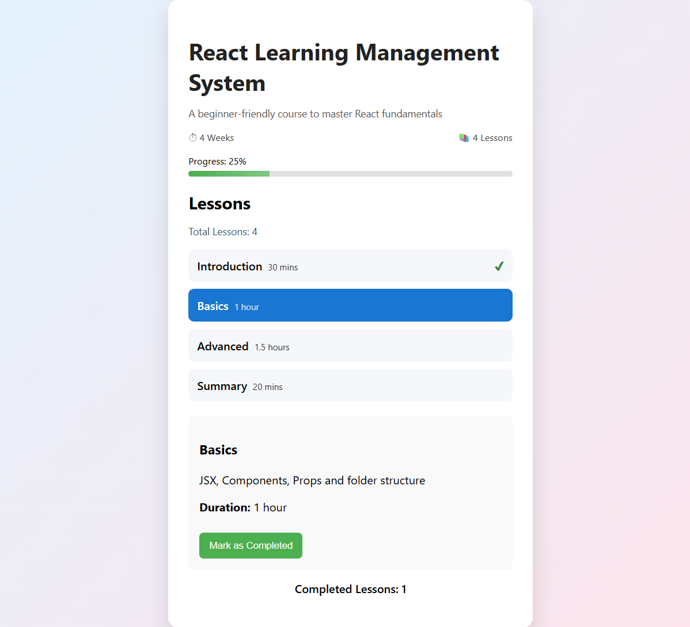

# React Learning Management System (LMS)

A mini React LMS frontend project showing interactive lessons with progress tracking.

## Features
- Display course title, description, and duration
- Static lesson list: Introduction, Basics, Advanced, Summary
- Click a lesson to view details
  - Highlight selected lesson
  - Show lesson description
  - Show lesson duration
  - "Mark as Completed" option
- Show total lessons count
- Show completed lessons count
- Clean and professional UI

## Screenshot


## How to Run
1. Clone the repository:
   ```bash
   git clone https://github.com/Rethna-R/react-lms-frontend.git
